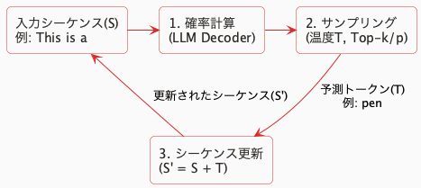
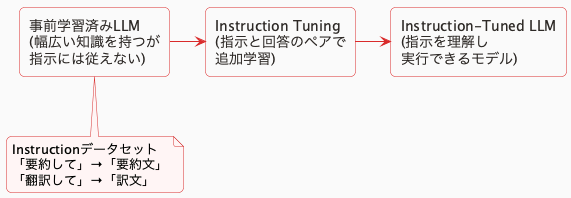
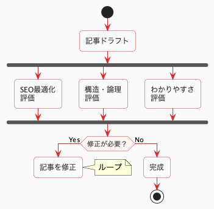

<!-- _class: title -->


# コンテキストエンジニアへの道
## 〜基礎からエージェント設計まで〜

### 株式会社広告制作所様向け

---


# 背景

- AIの普及で非エンジニアでも誰でもなんでもできる時代になった
- LLMを使うだけならAPIを呼ぶだけ（fetchやaxiosで呼ぶのと同じ）
- 案件の数に比べて圧倒的に**AIエンジニアの数が少ない**

# 狙い

- 誰でもLLMを組み合わせた設計をイメージできる
- 簡単なPoCを誰でもできる
- プロダクトのフィードバックループの設計イメージができる

---


# 今日みなさんが目指す姿

| 普段Pythonを使う方 | 普段Python以外を使う方 |
|:--|:--|
| 適切に問題を分解しLLMで解決 | データ活用プロダクト設計をイメージ |
| コンテキストエンジニアリング | （AI）エンジニアの業務理解 |
| データを活用した設計 | 用語や概念の理解 |
| 今日の演習問題すべて解ける | 簡単なPoCならできる |
| → **設計し、実装までできる** | → **理解してイメージできる** |

**Python以外の方**: [Python基礎ガイド](./python-basics.md)を用意しています

---


# 環境設定

- 別資料へ
- レポジトリ

# 情報の取り扱い注意

今日の勉強会では**業務データ入力禁止**

後半演習の一部でn8nを使いますが見られても良いデータのみ可

---


# いろんなLLM

| OpenAI | Google | Anthropic |
|:--|:--|:--|
| GPT-5.1 | Gemini-2.5-Pro | Claude Opus 4 |
| GPT-4o | Gemini-2.5-Flash | Claude Sonnet 4 |
| o3 | Gemini-2.5-Flash-Lite | |
| o1 | | |

## 何がどう優れているの？どう違うの？

「LLM Leaderboard」で検索！

- https://artificialanalysis.ai/leaderboards/models
- https://lmarena.ai/leaderboard

---


# LLMの仕組み

## Next Token Prediction（次の単語予測）

次のカッコに入るのは何？ → 例：This is a (　　　)



予測変換の超高精度版。これを繰り返して文章を生成している

---


# こんなのでうまく答えられるの？

- 「次の単語を予測するだけ」で本当に質問に答えられる？
- 実は、そのままだと**質問に対して質問で返す**ことがある
- 大量のテキストで学習しただけでは「指示に従う」能力は弱い

→ そこで登場するのが **Instruction Tuning**

---


# Instruction Tuning

指示に従うようにするためのファインチューニング



オープンなLLMで `-Instruct` や `-it` って付いているのはこれ

---


# Reasoning / Thinking とは？

- 推論/思考してから応答するように学習されている
  - GPT-5, o1, Gemini-2.5-Pro等
- 推論/思考が無いモデルはそのまま応答を出力
  - GPT-4o, Gemini-2.5-Flash-Lite等

## DeepSeek-R1の例

| 入力 | 日本の首都は？ |
|:--|:--|
| 出力 | `<think>`ユーザーは日本の首都について質問している。私の知識によれば、日本の首都は東京である。`</think>`東京です。 |

---


# プロンプトエンジニアリング

## 基本テクニック

- Markdown/XML記法で書く
- 構造化出力を使う
- 適切な単位でプロンプトを分ける
- 入出力例を与える（Few-shot）
- ステップの明示（Chain of Thought）
- 理由を説明させてから回答させる

これはMUSTですが覚えるだけ

---


# プロンプトエンジニアリング

## 基本テクニック（続き）

- 役割付与（「あなたは優秀な○○です」）
- 否定語の代わりに肯定文（「しないで」→「禁止する」）
- ハルシネーション対策（「答えがない場合、無理に回答は禁止します」）

---


# プロンプトチューニングでうまくいかないときに...

# 指示をどんどん足しまくらないで！

# AIに適当に修正させないで！

（修正させたなら必ず全部自分で見て）

---


# プロンプトの洗練

うまく動かない時、指示を足すのではなく、**一度全体を見直すことが大切**

- **重複語彙** / 冗長な表現の削除
- 重要な指示は前方か後方へ
- 改行位置を意味のあるまとまりで調整
- 長い文を箇条書きで整理する
- 重要な部分にだけ強調 `**` を使う

無駄に長いプロンプトは、コストと応答時間の増加、**内容の把握が困難**になる

---


# 良い例と悪い例をいくつか紹介

実際のプロンプトで「やりがちなミス」と「改善方法」を見てみよう

---


# 悪いプロンプト例1

```markdown
# 指示
新入社員向けのビジネスマナー研修で使う、プレゼン資料（1時間枠）の構成案を作成。

## 研修の目的
この研修のゴールは、新しく入社した社員たちが社会人としての基本的なマナーを
身につけることと、彼らが学生気分を脱し、プロフェッショナルとして仕事を覚える
ようになることが重要です。資料は視覚的にもアピールし、わかりやすく...

## ターゲット / 対象
対象者は、当然ながら新卒入社の社員です。彼らにはビジネスの現場経験がほとんど
無いことを前提に想定してください。具体的な事例をできるだけ出して説明...
```

---


# 先程のプロンプトの悪いところ

## 同じ指示の重複
→ 「新入社員向け・分かりやすく」という指示が複数セクションに重複

## 重要な指示が真ん中に来ている
→ 最も厳守すべき指示がプロンプトの真ん中に埋もれて無視されやすい

## 長々と書いている
→ 重要な指示が効きにくい上、**人間が把握できなく**なりチューニング困難

---


# 改善したプロンプト例1

```markdown
# 指示
新入社員向け「ビジネスマナー研修（1時間）」のプレゼン資料の構成案を作成。

# 必須要件
資料の最後に、必ず**「情報セキュリティとコンプライアンスに関するクイズ」
を設ける**こと。

# 研修の概要
- ターゲット：新卒社員（ビジネス経験ゼロ）
- 目的：社会人としての基本マナー習得、プロ意識の醸成
- トーン：堅苦しすぎず、親しみやすいが緊張感も保つ
```

---


# 悪い例2 → 改善例2

**悪い例の問題点:**
- 冒頭の同じ1文なのに無駄な改行
- 箇条書き項目をすべて強調（AIに書かせるとこうなる）

**改善ポイント:**
- 意味のない改行を削除
- 重要部分だけ強調
- 否定文を肯定文に変更

---


# 実践演習（ハンズオン）〜前半〜

- 穴埋め問題 `./practice/` を編集して進めてみよう
- `uv run python practice/genai_ver/a1.py` で実行
- 困ったらAIに聞いたり、答えの `./src/` を見ながらOK

**Pythonに慣れていない方**: [Python基礎ガイド](./python-basics.md)を参照
**速く終わった方**: `genai_ver` と `langchain_ver` 両方見てみよう

---


# 基礎: APIを呼ぶ

## 演習A1: 入力された文から趣味を単語で抽出
→ `./practice/genai_ver/a1.py` を埋める

## 演習A2: 温度を調整して出力の差を感じよう
→ `./practice/genai_ver/a2.py` を埋める

1. キーワードを与えて小説を書いてもらおう
2. 文を与えて翻訳させてみよう
- **温度を調整**して何回か実行してみよう

---


# 基礎: APIを呼ぶ

## 演習A3: 思考のON/OFFを切り替えてレイテンシの差を感じよう

1. 思考モデルで**思考**を切ってみよう
2. 思考過程を表示してみよう

## 演習A4: 連続的な対話の履歴を管理しよう

- 連続的な会話でちゃんと覚えているかどうか確認しよう
- LLMには**毎回全ての会話履歴が送られている**ことを体験する

---


# 構造化出力を体験する

## 演習B: ECサイトに寄せられたコメントを処理する

入力文サンプル:
> スマート加湿器を購入。静音性は期待通り。給水が面倒なのがマイナス。

## 演習B1: ポジティブ/ネガティブをクラス分類

- ニュートラルなコメントをどうするかも考えてみよう
- 参考: [公式ドキュメント](https://ai.google.dev/gemini-api/docs/structured-output)
- TypeScriptで言う「型安全なAPIレスポンス」を実現する仕組み

---


# 構造化出力を体験する

## 演習B2: 商品名・ポジティブ/ネガティブな点・スコアを抽出
- 複数項目といろんな型を体験する

## 演習B3: カテゴリ別に分類して抽出
- カテゴリ（機能、品質、価格、デザイン、使い勝手）ごとに抽出
- ネスト構造化出力を体験する

---


# 複数LLMに分ける

複雑なタスクを1つのLLMにやらせると、性能が足りなかったり、速度が落ちる
→ タスクを分解して、複数LLMを組み合わせる体験をしよう

フロントエンドでの例: 巨大なコンポーネントを分割するのと同じ発想

## 演習C: 技術記事ドラフトを多角的に分析・改善

| 記事の評価 | 問題点の特定と改善案の生成 |
|:--|:--|
| 技術的正確性 | 修正版の作成 |
| わかりやすさ | フィードバックループ |
| 構成・論理展開 | |
| SEO最適化 | |

---


# 複数LLMに分ける

<div class="two-columns">
<div>

たとえばこんな設計:

- **問題点の特定**を評価側で、**改善案の生成**は修正側で多段など
- 場合分けがプロンプトに入る場合はプログラム側で制御

</div>
<div>



</div>
</div>

---


# 複数LLMに分ける

## 演習C1: 複数の評価軸を別々で処理

- 独立している処理は分割できる
- 逐次実行と並列実行の実行時間を比較
  - JSの`Promise.all()`と同じ概念（Pythonでは`asyncio.gather()`）

---


# 複数LLMに分ける

## 演習C2: 評価結果を使って記事を修正

- C1の4つの評価結果を受け取って記事を修正

## 演習C3: 修正・評価ループを作る（チャレンジ）

- C1を修正が必要かどうかも出力させてループを抜ける
- 最大3回まで（**無限ループ注意**）
- JSの`while`ループと同じ（条件付きで繰り返し）

---


# 解説A

（ネタバレしたくない方はここで戻ってください）

ソースコード:
- genai: [A1](./src/genai_ver/a1.py), [A2](./src/genai_ver/a2.py), [A3](./src/genai_ver/a3.py), [A4](./src/genai_ver/a4.py)
- LangChain: [A1](./src/langchain_ver/a1.py), [A2](./src/langchain_ver/a2.py), [A3](./src/langchain_ver/a3.py), [A4](./src/langchain_ver/a4.py)

---


# 解説A1~A3: 基本, 温度, 思考の設定（genai）

```python
from google import genai
from google.genai.types import GenerateContentConfig, ThinkingConfig

client = genai.Client()  # APIクライアントを作成
input_text = "私はサッカーを趣味にしています。"
response = client.models.generate_content(
    model="gemini-2.5-flash",
    # f"..." はテンプレート文字列（JSの`${}`と同じ）
    contents=f"入力文から趣味を単語で抽出してください。\n入力文: {input_text}",
    config=GenerateContentConfig(
        temperature=0.1,  # A2: 温度の調整（0〜2、低いほど安定した出力）
        thinking_config=ThinkingConfig(thinking_budget=0, include_thoughts=True),
    ),
)
# response.text で結果のテキストを取得
```

---


# 解説A1~A3: 基本, 温度, 思考の設定（LangChain）

```python
from langchain_google_genai import ChatGoogleGenerativeAI
from langchain_core.prompts import PromptTemplate

# LLMクライアントを設定
llm = ChatGoogleGenerativeAI(
    temperature=1, model="gemini-2.5-flash",
    thinking_budget=0, include_thoughts=True,
)
# プロンプトテンプレートを定義（{input_text}が変数）
prompt = PromptTemplate.from_template(
    "入力文から趣味を単語で抽出してください。\n入力文: {input_text}"
)
chain = prompt | llm  # パイプ(|)でプロンプト→LLMをつなぐ
result = chain.invoke({"input_text": "私はサッカーを趣味にしています。"})
```

LangChainだと変数を呼び出し時に埋める書き方が自然にできる

---


# 解説A4: 対話（genai）

```python
history = []  # 会話履歴を保持するリスト（JSの配列と同じ）
while True:   # 無限ループ（Ctrl+Cで終了）
    user_input = input("入力してください: ")  # ユーザー入力を受け取る
    # 履歴にユーザーの発言を追加
    history.append(types.Content(role="user", parts=[types.Part(text=user_input)]))
    response = client.models.generate_content(
        model="gemini-2.5-flash-lite",
        contents=history,  # 履歴全体をLLMに渡す
        config=types.GenerateContentConfig(system_instruction="必ず英語で応答"),
    )
    # 履歴にAIの応答を追加
    history.append(types.Content(role="model", parts=[types.Part(text=response.text)]))
```

同じセッションの対話は**毎回すべてLLMに入力されている**のを実感しよう

---


# 解説A4: 対話（LangChain）

```python
llm = ChatGoogleGenerativeAI(model="gemini-2.5-flash-lite")
prompt = ChatPromptTemplate.from_messages([
    ("system", "必ず英語で応答してください"),  # システムプロンプト
    MessagesPlaceholder(variable_name="history"),  # 会話履歴が入る場所
])
chain = prompt | llm | StrOutputParser()  # 出力をテキストに変換

history = []  # 会話履歴
while True:
    user_input = input("入力してください: ")
    history.append(HumanMessage(content=user_input))  # ユーザー発言を追加
    response = chain.invoke({"history": history})
    history.append(AIMessage(content=response))  # AI応答を追加
```

---


# 解説B

（ネタバレしたくない方はここで戻ってください）

ソースコード:
- genai: [B1](./src/genai_ver/b1.py), [B2](./src/genai_ver/b2.py), [B3](./src/genai_ver/b3.py)
- LangChain: [B1](./src/langchain_ver/b1.py), [B2](./src/langchain_ver/b2.py), [B3](./src/langchain_ver/b3.py)

---


# 解説B1: 構造化出力（genai）

```python
from pydantic import BaseModel, Field
from typing import Literal  # 選択肢を制限する型

# 出力の「型」を定義（TypeScriptのinterfaceに相当）
class CommentAnalysis(BaseModel):
    sentiment: Literal["positive", "negative", "neutral"] = Field(
        description="判定結果"  # LLMへの説明
    )

response = client.models.generate_content(
    model="gemini-2.5-flash-lite",
    contents=f"次のコメントの感情を判定してください。`{input_text}`",
    config=GenerateContentConfig(
        response_mime_type="application/json",  # JSON形式で出力
        response_schema=CommentAnalysis,  # この型に従って出力
    ),
)
```

---


# 解説B1: 構造化出力（LangChain）

```python
# 出力の「型」を定義（TypeScriptのinterfaceに相当）
class CommentAnalysis(BaseModel):
    sentiment: Literal["positive", "negative", "neutral"] = Field(
        description="判定結果"
    )

llm = ChatGoogleGenerativeAI(model="gemini-2.5-flash-lite")
prompt = PromptTemplate.from_template("次のコメントを分析: `{input_text}`")
# .with_structured_output()で型を指定 → 結果がその型のオブジェクトで返る
chain = prompt | llm.with_structured_output(CommentAnalysis)
result = chain.invoke({"input_text": "スマート加湿器を購入。静音性は期待通り。"})
# result.sentiment で "positive" などが取れる
```

OpenAIでもOllamaでも同じ書き方できるのが嬉しい

---


# 解説B2,B3: より複雑な構造化出力

```python
# 【B2】様々な型を使える（TypeScriptの型と対応）
class CommentAnalysis(BaseModel):
    product_name: str = Field(description="商品名")       # string
    positive_points: str = Field(description="ポジティブな点")
    negative_points: str = Field(description="ネガティブな点")
    score: int = Field(description="5段階のスコア", ge=1, le=5)  # number（整数）
    # ge=greater or equal（以上）, le=less or equal（以下）

# 【B3】クラスを入れ子にもできる（TSのネストしたinterfaceと同じ）
class CategoryFeedback(BaseModel):
    category: Literal["機能", "品質", "価格", "デザイン", "使い勝手"]
    positive_points: str
    negative_points: str
```

---


# 解説C

（ネタバレしたくない方はここで戻ってください）

ソースコード:
- genai: [C1](./src/genai_ver/c1.py), [C2](./src/genai_ver/c2.py), [C3](./src/genai_ver/c3.py)
- LangChain: [C1](./src/langchain_ver/c1.py), [C2](./src/langchain_ver/c2.py), [C3](./src/langchain_ver/c3.py)

---


# 解説C: 構造化出力の組み合わせ

C1: 各評価項目について次のような評価を出力させる

```python
class Evaluation(BaseModel):
    """評価結果"""
    needs_revision: bool = Field(description="修正が必要かどうか")  # boolean
    good_points: list[str] = Field(description="優れている点")  # string[]
    bad_points: list[str] = Field(description="改善が必要な点")   # string[]
```

- C2: レビュー結果をプロンプトに入れて修正させる
- C3: `needs_revision`がTrueの間ループを回す（最大3回で打ち切り）

---


# Function Callingとは？

LLMが**自分で判断して関数を呼び出す**仕組み

## 基本的な流れ

1. **関数を定義**: Python関数を定義し、docstringで説明を書く
2. **ツールとして渡す**: LLMに利用可能な関数のリストを渡す
3. **LLMが判断**: ユーザーの要求に応じて、適切な関数を選択
4. **関数を実行**: LLMが生成した関数呼び出しを実行
5. **結果を返す**: 実行結果をLLMに返して、最終的な回答を生成

---


# Function Calling: なぜ重要か？

- LLMは**最新情報を持たない**（学習データの時点まで）
- LLMは**外部システムにアクセスできない**（データベース、APIなど）
- Function Callingで**リアルタイムの情報取得**や**外部システム連携**が可能に

---


# Function Callingの仕組み

<div class="two-columns">
<div>

## 従来の方法
- プロンプトで「APIを呼んで」と指示
- LLMが「APIを呼んでください」と返すだけ
- **実際の処理は人間が行う**

</div>
<div>

## Function Calling
- 関数をツールとして定義
- LLMが**自動的に適切な関数を選択**
- **関数を実行して結果を取得**
- 結果を使って回答を生成

</div>
</div>

---


# Function Callingの実装例

```python
def get_weather(location: str) -> dict:
    """指定された場所の天気を取得する"""
    # 実際のAPI呼び出しなど
    return {"気温": "25℃", "天気": "晴れ"}

# 関数をツールとして渡す
response = client.models.generate_content(
    model="gemini-2.5-flash",
    contents="東京の天気は？",
    config=types.GenerateContentConfig(
        tools=[get_weather]  # 関数を直接渡せる
    ),
)

# LLMが自動的にget_weather("東京")を呼び出す
```

**ポイント**: 関数のdocstringがLLMへの説明として使われる

---


# Function Callingの実行フロー

1. **ユーザー入力**: 「東京の天気は？」
2. **LLMが判断**: `get_weather`関数を使うべきと判断
3. **関数呼び出し生成**: `get_weather(location="東京")`
4. **関数を実行**: 実際にPython関数を実行
5. **結果を取得**: `{"気温": "25℃", "天気": "晴れ"}`
6. **結果をLLMに返す**: 関数の実行結果をLLMに渡す
7. **最終回答生成**: 「東京の天気は晴れ、気温は25℃です」

**LLMは関数の実行結果を見てから回答を生成する**

---


# Function Callingの活用例

## 実用的なエージェントの例

- **計算**: 数式を計算する関数
- **メモ管理**: メモを保存・読み取る関数
- **日時取得**: 現在の日時を取得する関数
- **データベース検索**: データベースに問い合わせる関数
- **API呼び出し**: 外部APIを呼び出す関数

**複数の関数を組み合わせることで、実用的なエージェントが作れる**

---


# ツールとマルチモーダル

LLMはテキストだけでなく、**画像**や**外部ツール**を使って情報を取得・処理できる

## 演習D1: 画像入力でマルチモーダルを体験しよう

- 画像ファイルを読み込んでLLMに渡す
- 画像の内容を説明してもらう

---


# ツールとマルチモーダル

## 演習D2: Google検索ツールを使おう

- Geminiの組み込みツール（Google Search）を使う
- 最新情報を取得して回答する

## 演習D3: コード実行ツールを使おう

- LLMが生成したコードを自動実行
- 実行結果（グラフなど）を取得

---


# ツールとマルチモーダル

## 演習D4: Function Callingで独自関数を呼び出そう

- 自分で定義したPython関数をツールとしてLLMに渡す
- LLMが状況に応じて適切な関数を呼び出す
- 実際のAPIやデータベースと連携する基礎

---


# 解説D

（ネタバレしたくない方はここで戻ってください）

ソースコード:
- genai: [D1](./src/genai_ver/d1.py), [D2](./src/genai_ver/d2.py), [D3](./src/genai_ver/d3.py), [D4](./src/genai_ver/d4.py)
- LangChain: [D1](./src/langchain_ver/d1.py)

---


# 解説D1: マルチモーダル（genai）

```python
from google.genai import types

with open(image_path, "rb") as f:
    image_bytes = f.read()

response = client.models.generate_content(
    model="gemini-2.5-flash",
    contents=[
        types.Part.from_bytes(data=image_bytes, mime_type="image/png"),
        "画像の内容を説明してください",
    ],
)
```

画像とテキストを**リスト**で渡すことで、マルチモーダル入力が可能

---


# 解説D2: Google検索ツール（genai）

```python
response = client.models.generate_content(
    model="gemini-2.5-flash",
    contents=query,
    config=types.GenerateContentConfig(
        tools=[types.Tool(google_search=types.GoogleSearch())]
    ),
)
```

`tools`パラメータにツールを渡すと、LLMが自動的にツールを使いながら回答を生成

---


# 解説D3: コード実行ツール（genai）

```python
response = client.models.generate_content(
    model="gemini-2.5-flash",
    contents=prompt,
    config=types.GenerateContentConfig(
        tools=[types.Tool(code_execution=types.ToolCodeExecution)]
    ),
)

# 実行されたコードと結果を取得
for candidate in response.candidates:
    for part in candidate.content.parts:
        if hasattr(part, "executable_code"):
            code = part.executable_code.code  # 実行されたコード
        if hasattr(part, "inline_data"):
            image_data = part.inline_data.data  # 生成された画像など
```

LLMが生成したコードを自動実行し、結果（テキストや画像）を取得できる

---


# 解説D4: Function Calling（genai）

```python
def get_current_temperature(location: str) -> dict[str, str]:
    """今日の気温を調べる関数"""
    return {"気温": "25℃"}

def get_current_humidity(location: str) -> dict[str, str]:
    """今日の湿度を調べる関数"""
    return {"湿度": "50%"}

response = client.models.generate_content(
    model="gemini-2.5-flash",
    contents=query,
    config=types.GenerateContentConfig(
        tools=[get_current_temperature, get_current_humidity]
    ),
)
```

**Python関数を直接ツールとして渡せる**。関数のdocstringが説明として使われる

---


# Embedding（ベクトル化）

テキストを数値ベクトルに変換して、**意味的な類似度**を計算できる

## 演習E1: Embeddingで類似度を計算しよう

- テキストをEmbedding（ベクトル）に変換
- コサイン類似度で類似性を計算
- 「漫画」と「アニメ」は近い、「サッカー」は遠いことを体験

**用途**: 検索、レコメンデーション、RAG（後述）など

---


# 解説E1

（ネタバレしたくない方はここで戻ってください）

ソースコード:
- genai: [E1](./src/genai_ver/e1.py)
- LangChain: [E1](./src/langchain_ver/e1.py)

---


# 解説E1: Embedding（genai）

```python
import numpy as np

# Embeddingを取得（768次元のベクトルなど）
result = client.models.embed_content(
    model="text-multilingual-embedding-002",
    contents=["漫画", "アニメ", "サッカー"],
    config=types.EmbedContentConfig(
        task_type="SEMANTIC_SIMILARITY",
    ),
)
embeddings = [np.array(emb.values) for emb in result.embeddings]

# コサイン類似度を計算
def cosine_similarity(vec1: np.ndarray, vec2: np.ndarray) -> float:
    normed1 = vec1 / np.linalg.norm(vec1)
    normed2 = vec2 / np.linalg.norm(vec2)
    return np.dot(normed1, normed2)
```

Embeddingは**意味を数値化**したもの。似た意味のテキストは近いベクトルになる

---


# 解説E1: Embedding（LangChain）

```python
from langchain_google_genai import GoogleGenerativeAIEmbeddings

model = GoogleGenerativeAIEmbeddings(
    model="models/text-embedding-004",
)
embeddings = model.embed_documents(["漫画", "アニメ", "サッカー"])
```

LangChainでは`GoogleGenerativeAIEmbeddings`で簡単にEmbeddingを取得できる

---


# エージェントとは？

前半で学んだ要素がすべてつながる

| 学んだこと | エージェントでの役割 |
|:--|:--|
| API呼び出し（A） | LLMとの対話 |
| 構造化出力（B） | ツールの引数・結果の型定義 |
| 複数LLM（C） | タスク分解・ループ |
| Function Calling（D） | ツールの自動選択・実行 |
| Embedding（E） | 知識検索（RAG） |

**エージェント = LLM + ツール + 自律的な判断ループ**

---


# エージェントのアーキテクチャ

## 演習Cのループとの違い

| 演習C（フィードバックループ） | エージェント |
|:--|:--|
| 事前に決めた処理順序 | **LLMが自分で判断** |
| 固定のツール呼び出し | **状況に応じてツールを選択** |
| 決まった回数で終了 | **目的達成で自律的に終了** |

## エージェントの基本ループ

1. ユーザー入力を受け取る
2. LLMが**どのツールを使うか判断**（または直接回答）
3. ツールを実行し、結果をLLMに返す
4. LLMが結果を見て**最終回答を生成**（または再度ツール呼び出し）

---


# 実践演習（ハンズオン）〜後半〜

## 演習F: エージェントのコードを読んで理解しよう

**重要: これは実装演習ではありません**

- `./practice/genai_ver/` のFシリーズは**完成したコード**です
- コードを読んで、エージェントの仕組みを理解することが目標
- 各ファイルの「理解度チェック」に答えながら進めてください

**学習の進め方:**
1. コードを読む（コメントに注目）
2. `uv run python practice/genai_ver/f1.py` で実行して動作確認
3. 理解度チェックの質問に答える

---


# エージェントループを図解

```
ユーザー入力
    ↓
┌──────────────────────────────────────┐
│ STEP 1: LLMにツール情報を渡して呼び出す  │
│  → tools=[calculate, get_datetime]    │
│  → LLMは「使えるツール」を把握          │
└──────────────────────────────────────┘
    ↓
┌──────────────────────────────────────┐
│ STEP 2: LLMの判断を確認              │
│  → function_call あり → ツールを使う   │
│  → テキストのみ → 直接回答する         │
└──────────────────────────────────────┘
    ↓ (function_callの場合)
┌──────────────────────────────────────┐
│ STEP 3: プログラム側でツールを実行      │
│  → calculate("3 + 5 * 2") → 13      │
└──────────────────────────────────────┘
    ↓
┌──────────────────────────────────────┐
│ STEP 4: 結果をLLMに返して最終回答生成   │
│  → 「計算結果は13です」              │
└──────────────────────────────────────┘
```

**重要:** `generate_content` を**2回**呼んでいる（STEP 1とSTEP 4）

---


# 演習F1: 基本エージェントを読んで理解しよう

**読むファイル:** `practice/genai_ver/f1.py`（完成版）

**理解すべき概念:**
- STEP 1〜4がコードのどこに実装されているか
- なぜ `generate_content` を2回呼ぶのか
- LLMはどうやって「計算が必要」と判断しているか

**実行して確認:**
1. 「3 + 5 * 2を計算して」→ calculate ツールが実行される
2. 「今何時？」→ get_current_datetime ツールが実行される
3. 「おはよう」→ ツールを使わず直接回答

**重要な洞察:**
我々は「どのツールを使うか」のif文を書いていない。
**LLMが自律的に判断している** = これがエージェント

---


# 演習F2: マルチツールエージェントを理解しよう

**読むファイル:** `practice/genai_ver/f2.py`（完成版）

**F1との違いを探してください:**
- ツールが2個 → 5個に増えた
- しかし、エージェントループのコードは？ → **変わっていない**

**実験してみよう:**
1. 「買い物リストをメモして: りんご、バナナ」→ save_memo
2. 「買い物リストを読んで」→ read_memo
3. 「メモの一覧は？」→ list_memos

**重要な洞察:**
- ツールを追加するだけで機能拡張できる = **エージェントの拡張性**
- 各ツールのdocstringが「LLMへの説明書」になっている

---


# 演習F3: エージェント設計の考え方（発展）

**読むファイル:** `practice/genai_ver/f3.py`（タスク管理エージェント）

**設計の考え方を理解:**
- なぜ add_task / complete_task / list_tasks の3つに分けたか
- 1つの巨大な関数にするより、分けたほうがLLMが正確に判断できる

**ディスカッション:**
あなたの業務で役立ちそうなエージェントは？
- 例: 顧客管理（検索/追加/更新）
- 例: レポート生成（データ取得/分析/整形）
- 例: 翻訳（言語検出/翻訳/校正）

**エージェント開発の本質:**
「LLMに何をさせたいか」= ツール関数の設計。
ループ処理はF1〜F3すべて同じ

---


# 解説F: コードと概念の対応

演習Fのコードで、STEP 1〜4がどこに実装されているか確認しましょう

ソースコード:
- [F1](./practice/genai_ver/f1.py), [F2](./practice/genai_ver/f2.py), [F3](./practice/genai_ver/f3.py)
- 完成版エージェント: [agent.py](./src/genai_ver/agent.py)

---


# 解説F1: コードのどこがどのSTEPか

```python
# STEP 1: LLMにツール情報を渡して呼び出す
response = client.models.generate_content(
    contents=history,
    config=types.GenerateContentConfig(tools=tools),  # ← ここでツールを教える
)

# STEP 2: LLMの判断を確認
if hasattr(part, "function_call") and part.function_call:
    # → LLMが「ツールを使いたい」と判断した

    # STEP 3: プログラム側でツールを実行
    result = tool(**func_args)

# STEP 4: 結果をLLMに返して最終回答を生成
final_response = client.models.generate_content(
    contents=history,  # ← ツール実行結果が追加されている
)
```

**なぜ2回呼ぶ？** 1回目=ツール判断、2回目=最終回答生成

---


# 解説F: よくある質問

**Q: なぜ generate_content を2回呼ぶの？**
1回目: LLMが「どのツールを使うか」判断 → function_call を返す
2回目: ツール実行結果を見て、最終的な回答を生成

**Q: ツールの選択ロジック（if文）はどこに書くの？**
書きません。LLMが tools の情報（関数名・docstring・引数）を読んで自分で判断します

**Q: ツールを10個に増やしたらコードは変わる？**
tools リストに追加するだけ。エージェントループは変わりません

**Q: LLMは複数ツールを同時に呼べる？**
はい。for ループで parts を回しているのはそのためです

---


# 演習の振り返り: 何が変わったか

| 演習C（フィードバックループ） | 演習F（エージェント） |
|:--|:--|
| 我々が処理順序を決定 | **LLMが自律的に判断** |
| if文で評価軸を分岐 | **LLMがツールを選択** |
| 固定のループ回数 | **目的達成まで自律的に実行** |

## エージェント開発者の仕事

**我々が作るもの:**
1. ツール関数の定義（calculate, save_memo など）
2. ツールのリスト作成（tools = [...]）
3. エージェントループの実装（毎回同じ）

**LLMに任せるもの:**
1. どのツールを使うかの判断
2. ツールに渡す引数の決定
3. 最終回答の生成

---


# まとめ: 今日学んだこと

```
A: API呼び出し        → LLMと会話する基礎
B: 構造化出力          → 出力をプログラムで扱える形に
C: 複数LLM            → タスクを分解して並列・ループ処理
D: ツール・マルチモーダル → 外部機能との連携
E: Embedding           → 意味的な類似度の計算
F: エージェント構築     → すべてを組み合わせた自律型AI
```

## 次のステップ

- **RAG**: Embedding + ベクトルDB で社内ドキュメント検索
- **MCP**: ツールを標準化して再利用可能に
- **マルチエージェント**: 複数エージェントの協調

---

<!-- _class: title -->


# ありがとうございました

© 2025 RuntimeStudio Inc.
